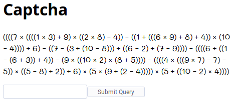

# C8: CAPTCHA

**Author:** Hrishikesh Hiraskar

```
Charvises (the native species which lived on Charvis 8HD before the first settlers arrived) were very good at math. In a surprising symbiosis relationship between humans and Charvises, it was agreed that the Charvises would be responsible for C8.

Can you pass their CAPTCHA (Completely Automated Public Turing Test to tell Charvises and Humans Apart)? 
```

The problem gives us with a web page that looks like this:



The problem is straight forward. Evaluate the given equation and submit the result.

Let's have a look the source of the equation.

```html
<p>
    HHHHQ j HHHHi j yL r EL j HHB j KL s hLL s HHi r HHHP j EL r KL r hLL j Hin s hLLLL r PL s HHQ s Hy r Hin s KLLL r HHP s BL r HQ s ELLLL s HHHHP r HHi s HP r yLL r hLL s HE j HHin j BL j HK r eLLLL s HHHHh j HHHE j QL s QL s eLL j HHe s KL r BLL r PL j He j HE r HB s hLLLLL j He r HHin s BL j hLLLL
</p>
```

What? Looks like they have mapped numbers and operators with letters. The interesting fact was this mapping was random, one can see the changing letters on each reload of page.

How are these mappings done? The `<p>` tag was using a font called `DigitalRightsDoneRight`. On checking css, we got to know that it was loaded using `base64` ttf font.

```css
@font-face{font-family: DigitalRightsDoneRight;src:url('data:application/font-ttf;charset=utf-8;base64,AAEAAA...
```

A search on ttf fonts led me to [An Introduction to TrueType Fonts: A look inside the TTF format](https://scripts.sil.org/cms/scripts/page.php?site_id=nrsi&id=iws-chapter08). It introduced me to two concepts in ttf fonts:

+ **Glyph Id**: A unique id for a character
+ **cmap**: A table that maps Glyph Id to character

I extracted the base64 ttf font from the page source and decoded it and stored it in a file. But this file is binary and not readable (See [font.ttf](font.ttf) for example).

Then I searched for python libraries to manipulate ttf fonts. I found [FontTools](https://pypi.org/project/FontTools/), which had a nice tool to convert ttf to ttx, and xml version of fonts. So, I converted our `font.ttf` to [font.ttx](font.ttx).

After opening the ttx, we get our `cmap`:

```xml
<cmap_format_4 platformID="0" platEncID="3" language="0">
    <map code="0x42" name="glyph00013"/><!-- LATIN CAPITAL LETTER B -->
    <map code="0x45" name="glyph00008"/><!-- LATIN CAPITAL LETTER E -->
    <map code="0x48" name="glyph00002"/><!-- LATIN CAPITAL LETTER H -->
    <map code="0x4b" name="glyph00003"/><!-- LATIN CAPITAL LETTER K -->
    <map code="0x4c" name="glyph00005"/><!-- LATIN CAPITAL LETTER L -->
    <map code="0x50" name="glyph00009"/><!-- LATIN CAPITAL LETTER P -->
    <map code="0x51" name="glyph00012"/><!-- LATIN CAPITAL LETTER Q -->
    <map code="0x65" name="glyph00014"/><!-- LATIN SMALL LETTER E -->
    <map code="0x68" name="glyph00011"/><!-- LATIN SMALL LETTER H -->
    <map code="0x69" name="glyph00010"/><!-- LATIN SMALL LETTER I -->
    <map code="0x6a" name="glyph00001"/><!-- LATIN SMALL LETTER J -->
    <map code="0x6e" name="glyph00015"/><!-- LATIN SMALL LETTER N -->
    <map code="0x72" name="glyph00006"/><!-- LATIN SMALL LETTER R -->
    <map code="0x73" name="glyph00004"/><!-- LATIN SMALL LETTER S -->
    <map code="0x79" name="glyph00007"/><!-- LATIN SMALL LETTER Y -->
</cmap_format_4>
```

It also has the ascii letter the glyph id is mapped to. So, here's how the whole mapping is done:

+ Number/Operator -> glyph id
+ glyph id -> letter

We thought there was a static mapping from these numbers and operators to glyph ids. We spent a good amount of time figuring out this mapping only to find out that this mapping was also random.

Then spending some time in ttx file, we got a width table as follows:

```xml
<hmtx>
    <mtx name="glyph00000" width="0" lsb="0"/>
    <mtx name="glyph00001" width="540" lsb="0"/>
    <mtx name="glyph00002" width="340" lsb="0"/>
    <mtx name="glyph00003" width="605" lsb="0"/>
    <mtx name="glyph00004" width="540" lsb="0"/>
    <mtx name="glyph00005" width="340" lsb="0"/>
    <mtx name="glyph00006" width="540" lsb="0"/>
    <mtx name="glyph00007" width="586" lsb="0"/>
    <mtx name="glyph00008" width="591" lsb="0"/>
    <mtx name="glyph00009" width="604" lsb="0"/>
    <mtx name="glyph00010" width="447" lsb="0"/>
    <mtx name="glyph00011" width="587" lsb="0"/>
    <mtx name="glyph00012" width="556" lsb="0"/>
    <mtx name="glyph00013" width="557" lsb="0"/>
    <mtx name="glyph00014" width="583" lsb="0"/>
    <mtx name="glyph00015" width="617" lsb="0"/>
</hmtx>
```

Each character occupies some width. This was a mapping of glyph id to width. Each of these width was unique, except `540` and `340`. `540` came thrice, so it must be the width of `+,-,*` while `340` came twice, so it must be width of brackets. Now the mapping looks like this:

+ Number/Operator -> Width
+ Width -> Glyph Id
+ Glyph Id -> letter

The only problem was with math operators (`+,-,*`) and the brackets. Brackets were easy, there was always an open bracket at the start and close bracket at the end. So, we directly have letter mapping to them.

For math operators, we had to again dig into ttx, fortunately there was this line:

```xml
<TTGlyph name="glyph00001" xMin="0" yMin="0" xMax="444" yMax="481">
```

which gave the cartesian position of the character and this was unique for each of the math operators. So, a special case mapping for math operators is:

+ Operator -> Cartesian position
+ Cartesian position -> Glyph Id
+ Glyph Id -> letter

Now, it was just a matter of writing the script. Also we had to send a token (embedded in html page) along with result while making the post request.

[eval.py](eval.py) gives full python script.

**Acknoledgement**

I thank @kaushiksk for helping me in writing the script.