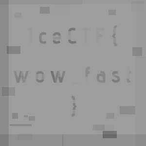

# Modern Picasso - Forensics

**Author:** Kaushik S Kalmady

We are presented with a GIF file.


First thing I observe is that tiny patches of pixels seem to appear at disjoint positions over the background. 
So maybe, if we separate out individual frames and stack them all together, we might see some form of pattern.

We can use an [online tool](https://ezgif.com/split) to extract all the frames from the GIF and download them as a ZIP archive.
We will then load all the frames in Python using PIL and add up together.

We extract the zip archive into a local folder and fire up the jupyter notebook and start our analysis.

```python
import glob
from PIL import Image
import numpy as np

# All the frames are extracted into the "./ezgif-2-2074f57414-gif-im/*" dir
files = glob.glob("./ezgif-2-2074f57414-gif-im/*")

imgs = []
for img in files:
    imgs.append(np.array(Image.open(img)))

imgs = np.array(imgs)
print(imgs.shape)
```

>(67, 300, 300) 

There are a total of 67 frames of size 300x300 each.

```python
imgsum = np.zeros((300,300))

for i in range(67):
    imgsum += imgs[i]

imgsum = imgsum % 256 # values might exceed 255
im = Image.fromarray(imgsum).convert("L") # Since this is now greyscale
im.save("combined-frames.png")
```

Looking at the combined image we see the flag.



## Flag
> IceCTF{wow_fast}

P.S There are definitely neater ways to solve this challenge. One of the [write-ups](https://github.com/shiltemann/CTF-writeups-public/blob/master/IceCTF-2018/writeup.md#forensics-150-modern-picasso) suggested recreating the gif with transparent background instead of white, where you can see the flag materialise in front of you. Anyway, this is how I solved it.
