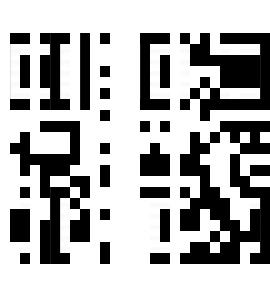

# C3 : Shredded

**Author**: Kaushik S Kalmady

```
Instructions to disable C3 were mistaken for an advertisement for new housing on Charvis 9HD. They’ve been shredded in the final office tidy-up. Nobody bothered to empty the trash, so a bit of glue and you should be good?

note: flag is in uppercase for this puzzle.

```

Extracting the jar file gives us 27 png images named 0.png up to 26.png which are thin vertical black and white stripes.

There are 27! possibilities so we need figure out how to narrow down to a tractable solution.

First I decided to stack them all horizontally to see what I get. I used PIL for this.


```python
import numpy as np
from PIL import Image

imgfiles = ["./{}.png".format(i) for i in range(27)]
images = map(Image.open, imgfiles)
widths, heights = zip(*(i.size for i in images))

total_width = sum(widths)
max_height = max(heights)

new_im = Image.new('RGB', (total_width, max_height))

x_offset = 0
for im in images:
    new_im.paste(im, (x_offset,0))
    x_offset += im.size[0]

new_im.save('test.jpg')
```

The output we get is 



It's clear from this that we need to generate a QR code and read data from it. We need to then first form a valid QR code.

Thanks to [@siddharthvdn](https://github.com/siddharthvdn/) for pointing me to this image


This image is extremely helpful, because we now know the patterns that will not change in the QR code, hence the vertical stripes that fit into this pattern will be deterministic! The two thin strips connecting the squares will help us arrange the given images to form a valid QR code.  We should then be able to brute-force whatever stripes remain to fill in the middle portions.

I used vectr to move around the pieces to generate a valid QR code.

One order that produced a QR code that followed all the patterns shown in the first image above is
> [0, 9, 11, 5, 6, 25, 2, 16, 15, 26,3, 20, 19, 21, 10, 23, 7, 8, 1, 24, 22, 4, 18, 14, 12, 13 ,17]

I generated an image stacking the vertical stripes in this order.

```python

order = [0, 9, 11, 5, 6, 25, 2, 16, 15, 26,3, 20, 19, 21, 10, 23, 7, 8, 1, 24, 22, 4, 18, 14, 12, 13 ,17]
imgfiles = ["./{}.png".format(i) for i in order]
images = map(Image.open, imgfiles)
widths, heights = zip(*(i.size for i in images))

total_width = sum(widths)
max_height = max(heights)

new_im = Image.new('RGB', (total_width, max_height))

x_offset = 0
for im in images:
    new_im.paste(im, (x_offset,0))
    x_offset += im.size[0]

new_im.save('test_ordered.jpg')
```


I then loaded this image and tried to scan it using the `qrtools` module.

```python
from qrtools import QR
qr = QR()
qr.decode("test_ordered.jpg")
print qr.data
```

> NULL

This printed NULL. Meaning this wasn't a valid QR or there was no data within.

This is understandable because if we observe, there are columns that are interchangeable. Since the number of such swaps are deterministic, we can identify them and brute-force through all combinations.

Here, each list represents vertical stripes that are interchangeable.

```python
rightsqborder = [order.index(i) for i in [14, 8]]
leftsqwhites = [order.index(i)  for i in [6, 15]]
rightsqwhites = [order.index(i)  for i in [1, 18]]
leftsmallsq = [order.index(i) for i in [25, 2, 16]]
rightsmallsq = [order.index(i) for i in [24, 22, 4]]
verticalwhites = [order.index(i) for i in [3, 7]]
blackdots = [order.index(i) for i in [20, 21, 23]]
whitedots = [order.index(i) for i in [19, 10]]
```

The total number of variations that we can produce is `3!*3*2!*5`.

Now the code to brute-force the permutations and get the flag:

```python
from PIL import Image
import copy
from itertools import permutations
from qrtools import QR

order = [0, 9, 11, 5, 6, 25, 2, 16, 15, 26,3, 20, 19, 21, 10, 23, 7, 8, 1, 24, 22, 4, 18, 14, 12, 13 ,17]
imgfiles = ["./{}.png".format(i) for i in order]
images = map(Image.open, imgfiles)
widths, heights = zip(*(i.size for i in images))

total_width = sum(widths)
max_height = max(heights)

images_copy = copy.copy(images)
idx = 0
qr = QR()

for perm1 in permutations(rightsqborder):
    for i in range(len(rightsqborder)):
        images_copy[rightsqborder[i]] = images[perm1[i]]
    
    for perm2 in permutations(leftsqwhites):
        for i in range(len(leftsqwhites)):
            images_copy[leftsqwhites[i]] = images[perm2[i]]
        
        for perm3 in permutations(rightsqwhites):
            for i in range(len(rightsqwhites)):
                images_copy[rightsqwhites[i]] = images[perm3[i]]
            
            for perm4 in permutations(leftsmallsq):
                for i in range(len(leftsmallsq)):
                    images_copy[leftsmallsq[i]] = images[perm4[i]]
                
                for perm5 in permutations(rightsmallsq):
                    for i in range(len(rightsmallsq)):
                        images_copy[rightsmallsq[i]] = images[perm5[i]]
                    
                    for perm6 in permutations(verticalwhites):
                        for i in range(len(verticalwhites)):
                            images_copy[verticalwhites[i]] = images[perm6[i]]
                            
                        for perm7 in permutations(blackdots):
                            for i in range(len(blackdots)):
                                images_copy[blackdots[i]] = images[perm7[i]]
                            
                            for perm8 in permutations(whitedots):
                                for i in range(len(whitedots)):
                                    images_copy[whitedots[i]] = images[perm8[i]]
                                
                                new_im = Image.new('RGB', (total_width, max_height))

                                x_offset = 0
                                for im in images_copy:
                                    new_im.paste(im, (x_offset,0))
                                    x_offset += im.size[0]

                                new_im.save('test_{}.jpg'.format(idx))
                                
                                
                                qr.decode('test_{}.jpg'.format(idx))
                                print qr.data
                                
                                if "FLAG" in qr.data:
                                    import sys
                                    sys.exit()
                                
                                idx += 1
```

This prints a few NULL values initially and then we get a valid string.

> GOOD JOB. FLAG-80AD8BCF79

## Flag
> FLAG-80AD8BCF79

